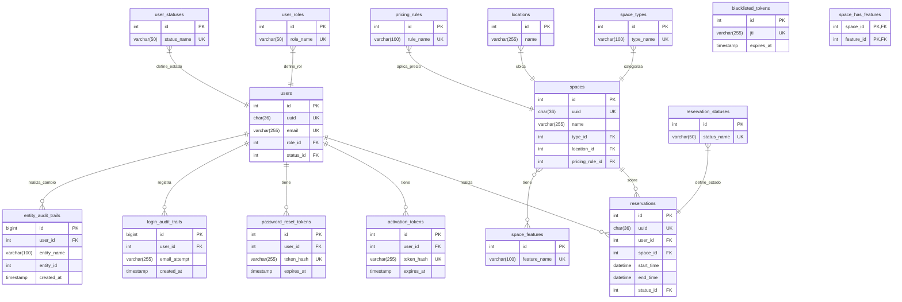

# Modelo Conceptual de Base de Datos: Sistema de Reservas

Como arquitecto de datos senior, he analizado el contexto de negocio proporcionado en los documentos "AGENCIA DE RESERVAS.pdf" e "Historias de Usuario.md" para diseñar un modelo de base de datos robusto, normalizado y optimizado para el sistema de reservas.

A continuación, presento la propuesta completa, adhiriéndome estrictamente a todos los requisitos técnicos y de formato.

### **Diagrama Conceptual y Relaciones**

El siguiente catálogo de entidades describe las relaciones y cardinalidades. Un diagrama visual ER (Entidad-Relación) seguiría esta estructura:

-   `users` tiene una relación 1:N con `reservations`, `activation_tokens`, `password_reset_tokens` ✅, `login_audit_trails`, y `entity_audit_trails`.
-   `user_roles` y `user_statuses` tienen una relación N:1 con `users`.
-   `spaces` tiene una relación 1:N con `reservations`.
-   `space_types`, `locations` y `pricing_rules` tienen una relación N:1 con `spaces`.
-   `spaces` y `space_features` tienen una relación N:M, resuelta a través de una tabla de unión `space_has_features`.
-   `reservation_statuses` tiene una relación N:1 con `reservations`.
-   `blacklisted_tokens` es una entidad independiente que registra JWTs invalidados.
-   `entity_audit_trails` tiene una relación polimórfica conceptual con todas las entidades auditadas.

---

### **Catálogo de Entidades Estructurado**

#### **NIVEL 0 (Catálogos Fundamentales)**

<details>
<summary>ENTIDAD: user_roles ✅ (roles)</summary>

**NIVEL DE DEPENDENCIA:** 0
**DESCRIPCIÓN:** Catálogo de roles de usuario (ej: 'cliente', 'administrador').

**ATRIBUTOS:**
- `id`: INT, PRIMARY KEY AUTO_INCREMENT
- `uuid`: CHAR(36), UNIQUE NOT NULL, DEFAULT (UUID())
- `role_name`: VARCHAR(50), UNIQUE NOT NULL (HU-001, HU-005)
- `description`: VARCHAR(255), NULLABLE
- `created_at`: TIMESTAMP DEFAULT CURRENT_TIMESTAMP

**RELACIONES:**
- 1:N con `users`

**ÍNDICES MYSQL:**
1.  **PRIMARY KEY** (`id`)
2.  **UNIQUE INDEX** `idx_user_roles_uuid` (`uuid`)
3.  **UNIQUE INDEX** `idx_user_roles_role_name` (`role_name`)

**JUSTIFICACIÓN DE ÍNDICES:**
- `idx_user_roles_role_name`: Garantiza unicidad y acelera la búsqueda de roles por su nombre, una operación común en la lógica de negocio y autorización.

</details>

<details>
<summary>ENTIDAD: user_statuses ✅ (status)</summary>

**NIVEL DE DEPENDENCIA:** 0
**DESCRIPCIÓN:** Catálogo de estados de cuenta de usuario (ej: 'pending', 'active', 'suspended').

**ATRIBUTOS:**
- `id`: INT, PRIMARY KEY AUTO_INCREMENT
- `uuid`: CHAR(36), UNIQUE NOT NULL, DEFAULT (UUID())
- `status_name`: VARCHAR(50), UNIQUE NOT NULL (HU-002, HU-003)
- `description`: VARCHAR(255), NULLABLE
- `created_at`: TIMESTAMP DEFAULT CURRENT_TIMESTAMP

**RELACIONES:**
- 1:N con `users`

**ÍNDICES MYSQL:**
1.  **PRIMARY KEY** (`id`)
2.  **UNIQUE INDEX** `idx_user_statuses_uuid` (`uuid`)
3.  **UNIQUE INDEX** `idx_user_statuses_status_name` (`status_name`)

**JUSTIFICACIÓN DE ÍNDICES:**
- `idx_user_statuses_status_name`: Clave para búsquedas rápidas de usuarios por estado (ej: obtener todos los usuarios 'activos').

</details>

<details>
<summary>ENTIDAD: space_types ✅ (space_types)</summary>

**NIVEL DE DEPENDENCIA:** 0
**DESCRIPCIÓN:** Catálogo de tipos de espacios (ej: 'sala_reuniones', 'auditorio', 'oficina_privada').

**ATRIBUTOS:**
- `id`: INT, PRIMARY KEY AUTO_INCREMENT
- `uuid`: CHAR(36), UNIQUE NOT NULL, DEFAULT (UUID())
- `type_name`: VARCHAR(100), UNIQUE NOT NULL (HU-008)
- `description`: TEXT, NULLABLE
- `created_at`: TIMESTAMP DEFAULT CURRENT_TIMESTAMP

**RELACIONES:**
- 1:N con `spaces`

**ÍNDICES MYSQL:**
1.  **PRIMARY KEY** (`id`)
2.  **UNIQUE INDEX** `idx_space_types_uuid` (`uuid`)
3.  **UNIQUE INDEX** `idx_space_types_type_name` (`type_name`)

**JUSTIFICACIÓN DE ÍNDICES:**
- `idx_space_types_type_name`: Esencial para filtrar espacios por tipo en las búsquedas de disponibilidad (HU-008).

</details>

<details>
<summary>ENTIDAD: reservation_statuses ✅ (status - compartida con user_statuses)</summary>

**NIVEL DE DEPENDENCIA:** 0
**DESCRIPCIÓN:** Catálogo de estados de una reserva (ej: 'confirmada', 'cancelada', 'finalizada').

**ATRIBUTOS:**
- `id`: INT, PRIMARY KEY AUTO_INCREMENT
- `uuid`: CHAR(36), UNIQUE NOT NULL, DEFAULT (UUID())
- `status_name`: VARCHAR(50), UNIQUE NOT NULL (HU-009, HU-010)
- `description`: VARCHAR(255), NULLABLE
- `created_at`: TIMESTAMP DEFAULT CURRENT_TIMESTAMP

**RELACIONES:**
- 1:N con `reservations`

**ÍNDICES MYSQL:**
1.  **PRIMARY KEY** (`id`)
2.  **UNIQUE INDEX** `idx_reservation_statuses_uuid` (`uuid`)
3.  **UNIQUE INDEX** `idx_reservation_statuses_status_name` (`status_name`)

**JUSTIFICACIÓN DE ÍNDICES:**
- `idx_reservation_statuses_status_name`: Permite filtrar reservas de manera eficiente por su estado actual (ej: "mis reservas activas").

</details>

---

#### **NIVEL 1 (Entidades Principales)**

<details>
<summary>ENTIDAD: users ✅ (users, user_activation_tokens, password_reset_tokens, sessions)</summary>

**NIVEL DE DEPENDENCIA:** 1 (depende de `user_roles`, `user_statuses`)
**DESCRIPCIÓN:** Entidad central que almacena la información de los usuarios del sistema.

**ATRIBUTOS:**
- `id`: INT, PRIMARY KEY AUTO_INCREMENT
- `uuid`: CHAR(36), UNIQUE NOT NULL, DEFAULT (UUID())
- `full_name`: VARCHAR(255), NOT NULL (HU-001)
- `email`: VARCHAR(255), UNIQUE NOT NULL (HU-001)
- `password_hash`: VARCHAR(255), NOT NULL (HU-001)
- `role_id`: INT, FK → `user_roles`.`id`, NOT NULL (HU-001, HU-005)
- `status_id`: INT, FK → `user_statuses`.`id`, NOT NULL (HU-002, HU-003)
- `last_login_at`: TIMESTAMP, NULLABLE
- `created_at`: TIMESTAMP DEFAULT CURRENT_TIMESTAMP
- `updated_at`: TIMESTAMP DEFAULT CURRENT_TIMESTAMP ON UPDATE CURRENT_TIMESTAMP
- `deleted_at`: TIMESTAMP, NULLABLE (para soft-delete, HU-admin)

**RELACIONES:**
- N:1 con `user_roles`
- N:1 con `user_statuses`
- 1:N con `reservations`, `activation_tokens`, `password_reset_tokens` ✅

**ÍNDICES MYSQL:**
1.  **PRIMARY KEY** (`id`)
2.  **UNIQUE INDEX** `idx_users_uuid` (`uuid`)
3.  **UNIQUE INDEX** `idx_users_email` (`email`)
4.  **INDEX** `idx_users_role_status` (`role_id`, `status_id`)

**JUSTIFICACIÓN DE ÍNDICES:**
- `idx_users_email`: Crítico para el login (HU-004) y para evitar registros duplicados (HU-001). Alta selectividad.
- `idx_users_role_status`: Índice compuesto para consultas administrativas que filtran usuarios por rol y estado (ej: "listar todos los clientes activos").

</details>

<details>
<summary>ENTIDAD: spaces ✅ (spaces, space_images, space_features)</summary>

**NIVEL DE DEPENDENCIA:** 1 (depende de `space_types`, `locations`, `pricing_rules`)
**DESCRIPCIÓN:** Representa los espacios físicos disponibles para reserva.

**ATRIBUTOS:**
- `id`: INT, PRIMARY KEY AUTO_INCREMENT
- `uuid`: CHAR(36), UNIQUE NOT NULL, DEFAULT (UUID())
- `name`: VARCHAR(255), NOT NULL (HU-008)
- `description`: TEXT, NULLABLE (HU-008)
- `capacity`: INT, NOT NULL (HU-008)
- `type_id`: INT, FK → `space_types`.`id`, NOT NULL (HU-008)
- `location_id`: INT, FK → `locations`.`id`, NOT NULL (HU-008)
- `pricing_rule_id`: INT, FK → `pricing_rules`.`id`, NOT NULL (HU-avanzada)
- `is_active`: BOOLEAN, DEFAULT TRUE (para habilitar/deshabilitar espacios)
- `created_at`: TIMESTAMP DEFAULT CURRENT_TIMESTAMP
- `updated_at`: TIMESTAMP DEFAULT CURRENT_TIMESTAMP ON UPDATE CURRENT_TIMESTAMP
- `deleted_at`: TIMESTAMP, NULLABLE (soft-delete)

**RELACIONES:**
- N:1 con `space_types`, `locations`, `pricing_rules`
- 1:N con `reservations`
- N:M con `space_features`

**ÍNDICES MYSQL:**
1.  **PRIMARY KEY** (`id`)
2.  **UNIQUE INDEX** `idx_spaces_uuid` (`uuid`)
3.  **INDEX** `idx_spaces_type_location_capacity` (`type_id`, `location_id`, `capacity`, `is_active`)
4.  **FULLTEXT INDEX** `idx_spaces_description_fulltext` (`name`, `description`)

**JUSTIFICACIÓN DE ÍNDICES:**
- `idx_spaces_type_location_capacity`: Índice compuesto de cobertura para la búsqueda principal de disponibilidad (HU-008), permitiendo filtrar eficientemente sin acceder a la tabla. `is_active` se incluye para excluir espacios inactivos.
- `idx_spaces_description_fulltext`: Permite búsquedas textuales eficientes en el nombre y descripción del espacio (ej: "buscar espacios con proyector").

</details>

---

#### **NIVEL 2 (Dependientes de Nivel 1)**

<details>
<summary>ENTIDAD: reservations ✅ (reservation)</summary>

**NIVEL DE DEPENDENCIA:** 2 (depende de `users`, `spaces`, `reservation_statuses`)
**DESCRIPCIÓN:** Almacena cada reserva de un espacio por un usuario, implementando la validación atómica de solapamiento.

**ATRIBUTOS:**
- `id`: INT, PRIMARY KEY AUTO_INCREMENT
- `uuid`: CHAR(36), UNIQUE NOT NULL, DEFAULT (UUID())
- `user_id`: INT, FK → `users`.`id`, NOT NULL (HU-009)
- `space_id`: INT, FK → `spaces`.`id`, NOT NULL (HU-009)
- `event_name`: VARCHAR(255), NOT NULL (HU-009)
- `start_time`: DATETIME(3), NOT NULL (HU-009)
- `end_time`: DATETIME(3), NOT NULL (HU-009)
- `status_id`: INT, FK → `reservation_statuses`.`id`, NOT NULL, DEFAULT 1 (HU-009)
- `cancellation_reason`: TEXT, NULLABLE (HU-010)
- `created_at`: TIMESTAMP DEFAULT CURRENT_TIMESTAMP
- `updated_at`: TIMESTAMP DEFAULT CURRENT_TIMESTAMP ON UPDATE CURRENT_TIMESTAMP
- `deleted_at`: TIMESTAMP, NULLABLE (soft-delete)

**RELACIONES:**
- N:1 con `users`, `spaces`, `reservation_statuses`

**ÍNDICES MYSQL:**
1.  **PRIMARY KEY** (`id`)
2.  **UNIQUE INDEX** `idx_reservations_uuid` (`uuid`)
3.  **INDEX** `idx_reservations_space_time` (`space_id`, `start_time`, `end_time`)
4.  **COMPOSITE INDEX** `idx_reservations_user_status_time` (`user_id`, `status_id`, `start_time` DESC)
5.  **INDEX** `idx_reservations_status_time` (`status_id`, `start_time`)

**JUSTIFICACIÓN DE ÍNDICES:**
- `idx_reservations_space_time`: **Índice crucial** para la validación de solapamiento (HU-009). Permite a la base de datos encontrar rápidamente todas las reservas para un `space_id` que se crucen con el rango `[start_time, end_time]`. Aunque la lógica final se aplica en la aplicación, este índice previene un full table scan. No puede ser `UNIQUE` directamente con rangos, por lo que se requiere lógica aplicativa apoyada en este índice.
- `idx_reservations_user_status_time`: Índice de cobertura para la consulta "Mis Reservas" (HU-010), ordenando por fecha descendente.
- `idx_reservations_status_time`: Optimiza tareas de fondo como la finalización automática de reservas pasadas.

</details>

<details>
<summary>ENTIDAD: activation_tokens ✅</summary>

**NIVEL DE DEPENDENCIA:** 2 (depende de `users`)
**DESCRIPCIÓN:** Almacena tokens de un solo uso para la activación de cuentas de usuario.

**ATRIBUTOS:**
- `id`: INT, PRIMARY KEY AUTO_INCREMENT
- `uuid`: CHAR(36), UNIQUE NOT NULL, DEFAULT (UUID())
- `user_id`: INT, FK → `users`.`id`, NOT NULL (HU-002)
- `token_hash`: VARCHAR(255), UNIQUE NOT NULL (HU-002)
- `activation_code`: VARCHAR(6), NULLABLE, Código numérico de 6 dígitos para validación
- `expires_at`: TIMESTAMP, NOT NULL (HU-002)
- `used_at`: TIMESTAMP, NULLABLE
- `validated_at`: TIMESTAMP, NULLABLE, Marca cuando se validó el código de activación
- `created_at`: TIMESTAMP DEFAULT CURRENT_TIMESTAMP

**RELACIONES:**
- N:1 con `users`

**ÍNDICES MYSQL:**
1.  **PRIMARY KEY** (`id`)
2.  **UNIQUE INDEX** `idx_activation_tokens_uuid` (`uuid`)
3.  **UNIQUE INDEX** `idx_activation_tokens_token_hash` (`token_hash`)

**JUSTIFICACIÓN DE ÍNDICES:**
- `idx_activation_tokens_token_hash`: Esencial para encontrar el token de forma instantánea durante el proceso de activación (HU-002).

</details>

<details>
<summary>ENTIDAD: password_reset_tokens ✅ (password_reset_tokens)</summary>

**NIVEL DE DEPENDENCIA:** 2 (depende de `users`)
**DESCRIPCIÓN:** Almacena tokens para el proceso de reseteo de contraseña.

**ATRIBUTOS:**
- `id`: INT, PRIMARY KEY AUTO_INCREMENT
- `uuid`: CHAR(36), UNIQUE NOT NULL, DEFAULT (UUID())
- `user_id`: INT, FK → `users`.`id`, NOT NULL (HU-003)
- `token_hash`: VARCHAR(255), UNIQUE NOT NULL (HU-003)
- `expires_at`: TIMESTAMP, NOT NULL (HU-003)
- `used_at`: TIMESTAMP, NULLABLE
- `created_at`: TIMESTAMP DEFAULT CURRENT_TIMESTAMP

**RELACIONES:**
- N:1 con `users`

**ÍNDICES MYSQL:**
1.  **PRIMARY KEY** (`id`)
2.  **UNIQUE INDEX** `idx_password_reset_tokens_uuid` (`uuid`)
3.  **UNIQUE INDEX** `idx_password_reset_tokens_token_hash` (`token_hash`)

**JUSTIFICACIÓN DE ÍNDICES:**
- `idx_password_reset_tokens_token_hash`: Optimiza la validación del token cuando el usuario hace clic en el enlace de reseteo (HU-003).

</details>

---

#### **NIVEL 3 (Dependientes de Nivel 2)**

<details>
<summary>ENTIDAD: blacklisted_tokens</summary>

**NIVEL DE DEPENDENCIA:** 3
**DESCRIPCIÓN:** Lista negra de tokens JWT que han sido explícitamente invalidados (ej: al cerrar sesión).

**ATRIBUTOS:**
- `id`: INT, PRIMARY KEY AUTO_INCREMENT
- `jti`: VARCHAR(255), UNIQUE NOT NULL (JWT ID)
- `expires_at`: TIMESTAMP, NOT NULL (Fecha de expiración del token original)
- `created_at`: TIMESTAMP DEFAULT CURRENT_TIMESTAMP

**RELACIONES:**
- Ninguna relación directa con otras tablas para mantener el desacoplamiento.

**ÍNDICES MYSQL:**
1.  **PRIMARY KEY** (`id`)
2.  **UNIQUE INDEX** `idx_blacklisted_tokens_jti` (`jti`)
3.  **INDEX** `idx_blacklisted_tokens_expires_at` (`expires_at`)

**JUSTIFICACIÓN DE ÍNDICES:**
- `idx_blacklisted_tokens_jti`: Crítico. Permite verificar en O(log N) si un JTI (JWT ID) está en la lista negra en cada petición autenticada.
- `idx_blacklisted_tokens_expires_at`: Para tareas de purga (borrado) de tokens ya expirados, evitando que la tabla crezca indefinidamente.

</details>

---

#### **NIVEL MAX (Auditoría)**

<details>
<summary>✅ ENTIDAD: login_audit_trails (tabla: login_audit_trails)</summary>

**NIVEL DE DEPENDENCIA:** MAX (depende de `users`)
**DESCRIPCIÓN:** Registra cada intento de inicio de sesión para auditoría de seguridad. **Volumetría alta.**

**ATRIBUTOS:**
- `id`: BIGINT, PRIMARY KEY AUTO_INCREMENT
- `uuid`: CHAR(36), UNIQUE NOT NULL, DEFAULT (UUID())
- `user_id`: INT, FK → `users`.`id`, NULLABLE (nullable para intentos con email no existente)
- `email_attempt`: VARCHAR(255), NOT NULL (HU-004)
- `ip_address`: VARCHAR(45), NOT NULL
- `user_agent`: TEXT, NOT NULL
- `status`: ENUM('success', 'failed_password', 'failed_user_not_found', 'failed_account_locked'), NOT NULL
- `created_at`: TIMESTAMP(3) DEFAULT CURRENT_TIMESTAMP(3)

**RELACIONES:**
- N:1 con `users`

**ÍNDICES MYSQL:**
1.  **PRIMARY KEY** (`id`)
2.  **INDEX** `idx_login_audit_trails_user_id_status_time` (`user_id`, `status`, `created_at` DESC)
3.  **INDEX** `idx_login_audit_trails_email_time` (`email_attempt`, `created_at` DESC)
4.  **INDEX** `idx_login_audit_trails_ip_time` (`ip_address`, `created_at` DESC)

**JUSTIFICACIÓN DE ÍNDICES:**
- Todos los índices son compuestos con `created_at` para soportar análisis de series temporales.
- `idx_login_audit_trails_user_id_status_time`: Para revisar el historial de logins de un usuario específico.
- `idx_login_audit_trails_email_time`, `idx_login_audit_trails_ip_time`: Para detectar patrones de ataque de fuerza bruta desde una misma IP o contra un mismo email.

</details>

<details>
<summary>✅ ENTIDAD: entity_audit_trails (tabla: entity_audit_trails)</summary>

**NIVEL DE DEPENDENCIA:** MAX (depende conceptualmente de todas las entidades auditables)
**DESCRIPCIÓN:** Tabla genérica para auditar operaciones (CREATE, UPDATE, DELETE) en entidades críticas. **Volumetría alta.**

**ATRIBUTOS:**
- `id`: BIGINT, PRIMARY KEY AUTO_INCREMENT
- `uuid`: CHAR(36), UNIQUE NOT NULL, DEFAULT (UUID())
- `user_id`: INT, FK → `users`.`id`, NULLABLE (para acciones del sistema)
- `entity_name`: VARCHAR(100), NOT NULL (ej: 'reservations', 'spaces')
- `entity_id`: INT, NOT NULL
- `operation`: ENUM('CREATE', 'UPDATE', 'DELETE', 'SOFT_DELETE', 'RESTORE'), NOT NULL (HU-010)
- `before_state`: JSON, NULLABLE (snapshot del registro antes del cambio)
- `after_state`: JSON, NOT NULL (snapshot del registro después del cambio)
- `created_at`: TIMESTAMP(3) DEFAULT CURRENT_TIMESTAMP(3)

**RELACIONES:**
- N:1 con `users`

**ÍNDICES MYSQL:**
1.  **PRIMARY KEY** (`id`)
2.  **COMPOSITE INDEX** `idx_entity_audit_trails_entity_time` (`entity_name`, `entity_id`, `created_at` DESC)
3.  **INDEX** `idx_entity_audit_trails_user_time` (`user_id`, `created_at` DESC)

**JUSTIFICACIÓN DE ÍNDICES:**
- `idx_entity_audit_trails_entity_time`: **Índice principal**. Permite reconstruir la historia completa de un registro específico (`reservations` con id=123) de manera ultraeficiente.
- `idx_entity_audit_trails_user_time`: Permite auditar todas las acciones realizadas por un usuario específico a lo largo del tiempo.

</details>

---

#### **NIVEL EXTRA (Extensiones Futuras)**
(Diseñadas para ser añadidas sin alterar el núcleo)

<details>
<summary>ENTIDAD: locations</summary>

**NIVEL DE DEPENDENCIA:** 0
**DESCRIPCIÓN:** Estructura jerárquica para ubicaciones físicas (país > ciudad > edificio).

**ATRIBUTOS:**
- `id`: INT, PRIMARY KEY AUTO_INCREMENT
- `uuid`: CHAR(36), UNIQUE NOT NULL, DEFAULT (UUID())
- `name`: VARCHAR(255), NOT NULL
- `address`: TEXT, NULLABLE
- `city`: VARCHAR(100), NOT NULL
- `country`: VARCHAR(100), NOT NULL
- `parent_location_id`: INT, FK → `locations`.`id`, NULLABLE (para anidar edificios en ciudades, etc.)
- `coordinates`: POINT, NULLABLE (para búsquedas geoespaciales)
- `created_at`: TIMESTAMP DEFAULT CURRENT_TIMESTAMP

**ÍNDICES MYSQL:**
1.  **PRIMARY KEY** (`id`)
2.  **INDEX** `idx_locations_country_city` (`country`, `city`)
3.  **SPATIAL INDEX** `idx_locations_coordinates_spatial` (`coordinates`)

</details>

<details>
<summary>ENTIDAD: space_features / ENTIDAD: space_has_features (N:M)</summary>

**NIVEL DE DEPENDENCIA:** 0 (space_features) / 2 (space_has_features)
**DESCRIPCIÓN:** Permite asignar características dinámicas a los espacios (ej: 'wifi', 'proyector').

**`space_features` (Nivel 0):**
- `id`: INT, PK
- `uuid`: CHAR(36), UNIQUE
- `feature_name`: VARCHAR(100), UNIQUE
- `icon_url`: VARCHAR(255), NULLABLE

**`space_has_features` (Nivel 2):**
- `space_id`: INT, FK → `spaces`.`id`
- `feature_id`: INT, FK → `space_features`.`id`
- **PRIMARY KEY** (`space_id`, `feature_id`)

</details>

<details>
<summary>ENTIDAD: pricing_rules ✅</summary>

**NIVEL DE DEPENDENCIA:** 0
**DESCRIPCIÓN:** Define reglas de precios (ej: precio por hora, tarifa de fin de semana).

**ATRIBUTOS:**
- `id`: INT, PK
- `uuid`: CHAR(36), UNIQUE
- `rule_name`: VARCHAR(100), UNIQUE
- `price_per_hour`: DECIMAL(10, 2), NOT NULL
- `currency`: CHAR(3), NOT NULL DEFAULT 'EUR'
- `created_at`: TIMESTAMP DEFAULT CURRENT_TIMESTAMP

</details>

---

### **Vistas Optimizadas Propuestas**

<details>
<summary>VISTA: v_reservation_details</summary>

**NIVEL:** Depende de Nivel 2, 1 y 0.
**PROPÓSITO:** Resolver la consulta compleja de obtener una vista denormalizada de las reservas para reportes y APIs.
**JUSTIFICACIÓN:** Evita múltiples JOINs en la aplicación cada vez que se necesita mostrar el detalle de una reserva. Reduce la carga de la CPU del servidor de BD al pre-unir la información más frecuente. Ideal para ser cacheada.
**COLUMNAS:** `reservation_uuid`, `event_name`, `start_time`, `end_time`, `reservation_status`, `space_name`, `space_uuid`, `user_full_name`, `user_email`, `user_uuid`, `location_name`.
**CONSULTA BASE:**
```sql
CREATE OR REPLACE VIEW v_reservation_details AS
SELECT
    r.uuid AS reservation_uuid,
    r.event_name,
    r.start_time,
    r.end_time,
    rs.status_name AS reservation_status,
    s.name AS space_name,
    s.uuid AS space_uuid,
    u.full_name AS user_full_name,
    u.email AS user_email,
    u.uuid AS user_uuid,
    l.name AS location_name
FROM reservations r
JOIN users u ON r.user_id = u.id
JOIN spaces s ON r.space_id = s.id
JOIN reservation_statuses rs ON r.status_id = rs.id
JOIN locations l ON s.location_id = l.id
WHERE r.deleted_at IS NULL;
```
**HU RELACIONADA:** HU-010, HU-011

</details>

<details>
<summary>VISTA: v_daily_occupation_report</summary>

**NIVEL:** Depende de Nivel 2 y 1.
**PROPÓSITO:** Generar un reporte de ocupación diaria por espacio.
**JUSTIFICACIÓN:** Las agregaciones (SUM, COUNT, GROUP BY) son costosas. Esta vista pre-calcula las horas reservadas por día y espacio, haciendo los reportes de ocupación (HU-admin) casi instantáneos en lugar de recalcularlos sobre la tabla `reservations` completa cada vez. Podría ser candidata a **vista materializada** si el volumen es muy alto.
**COLUMNAS:** `report_date`, `space_id`, `space_name`, `total_reservations`, `total_hours_booked`.
**CONSULTA BASE:**
```sql
CREATE OR REPLACE VIEW v_daily_occupation_report AS
SELECT
    DATE(r.start_time) AS report_date,
    s.id AS space_id,
    s.name AS space_name,
    COUNT(r.id) AS total_reservations,
    SUM(TIMESTAMPDIFF(MINUTE, r.start_time, r.end_time) / 60.0) AS total_hours_booked
FROM reservations r
JOIN spaces s ON r.space_id = s.id
WHERE r.status_id = (SELECT id FROM reservation_statuses WHERE status_name = 'confirmada') -- Solo confirmadas
AND r.deleted_at IS NULL
GROUP BY report_date, s.id, s.name;
```
**HU RELACIONADA:** HU-011 (y extensiones de reportes de admin)

</details>

---

### **Cumplimiento de HUs Críticas**

-   **Validación Atómica (HU-009):** La estrategia se basa en una combinación de un índice optimizado y una transacción a nivel de aplicación:
    1.  **Índice:** `idx_reservations_space_time` (`space_id`, `start_time`, `end_time`) permite una búsqueda extremadamente rápida de posibles colisiones.
    2.  **Transacción:** La lógica de la aplicación debe:
        -   `START TRANSACTION;`
        -   Ejecutar una consulta `SELECT` que busque reservas para el mismo `space_id` donde `(new_start < existing_end) AND (new_end > existing_start)`. Gracias al índice, esta consulta es muy rápida.
        -   Añadir `FOR UPDATE` a la consulta para bloquear las filas encontradas y prevenir que otra transacción concurrente modifique reservas en ese rango mientras se decide.
        -   Si la consulta no devuelve filas, se procede con el `INSERT` de la nueva reserva.
        -   `COMMIT;`
        -   Si devuelve filas, se hace `ROLLBACK;` y se notifica el conflicto.
-   **Integridad Referencial de Estados (HU-002, HU-003):** Se garantiza mediante el uso de `FOREIGN KEY` constraints. Por ejemplo, `users.status_id` debe apuntar a un `id` existente en `user_statuses`. Cualquier intento de asignar un estado inválido o de borrar un estado en uso (si no se configura `ON DELETE CASCADE/SET NULL`) será rechazado por la base de datos, asegurando la consistencia.
-   **Estrategia de Auditoría (HU-010):** La tabla `entity_audit_trails` cumple este requisito. Cualquier modificación en `reservations` (ej: cancelación) dispara un `trigger` a nivel de base de datos (o un `hook` en el ORM) que inserta un nuevo registro en `entity_audit_trails`, guardando quién (`user_id`), qué (`entity_name`, `entity_id`), cómo (`operation`) y el antes/después (`before_state`, `after_state` en JSON).

---

### **Consideraciones Avanzadas**

-   **Concurrencia:** La estrategia `SELECT ... FOR UPDATE` dentro de una transacción, como se describió para HU-009, es el método estándar y robusto para manejar `race conditions` en la creación de reservas.
-   **Escalabilidad (Multi-tenant):** Para extender el sistema, se añadiría una columna `tenant_id` (FK a una tabla `tenants`) a las tablas principales (`users`, `spaces`, `reservations`, etc.) y se incluiría en los índices compuestos para aislar los datos de cada cliente.
-   **Backup y Purga:**
    -   **Datos Transaccionales:** Backups frecuentes (cada hora o menos).
    -   **Tablas de Auditoría (`login_audit_trails`, `entity_audit_trails`):** Debido a su rápido crecimiento, se debe implementar una política de archivado/purga. Por ejemplo, mover registros de más de 1 año a un almacenamiento en frío (cold storage) y borrar los de más de 5 años, según la regulación.
-   **Monitoreo:** Las consultas de disponibilidad (HU-008) y los reportes de ocupación (HU-011) son los principales candidatos a ser lentos. Las vistas propuestas (`v_reservation_details`, `v_daily_occupation_report`) son la mitigación principal. Se debe monitorear el rendimiento del `planner` de MySQL en estas consultas.
-   **Orden de Migraciones:** Las migraciones deben crearse respetando los niveles de dependencia para evitar errores de `FOREIGN KEY`.
    1.  **Nivel 0:** `user_roles`, `user_statuses`, `space_types`, etc.
    2.  **Nivel 1:** `users`, `spaces` (y las demás de Nivel 1).
    3.  **Nivel 2:** `reservations`, etc.
    4.  **Nivel 3 y superiores.**
    5.  **Vistas:** Al final, una vez que todas las tablas base existan.

---

### **Glosario**

-   **3FN (Tercera Forma Normal):** Regla de diseño de bases de datos que busca reducir la redundancia de datos. Asegura que todos los atributos de una tabla dependan únicamente de la clave primaria, y no de otros atributos no clave.
-   **Soft-delete:** Estrategia que consiste en marcar un registro como borrado (usualmente con una columna como `deleted_at`) en lugar de eliminarlo físicamente de la base de datos. Permite recuperar datos y mantener la integridad histórica.
-   **Cardinalidad y Selectividad:** Términos de optimización de índices. La **cardinalidad** se refiere al número de valores únicos en una columna. Alta cardinalidad (muchos valores únicos, como un `email`) es ideal para índices. La **selectividad** es la capacidad de un índice para acotar los resultados; un índice en una columna con alta cardinalidad es muy selectivo.
-   **Índice de Cobertura (Covering Index):** Un índice que incluye todas las columnas requeridas por una consulta específica. Esto permite a la base de datos responder la consulta leyendo únicamente el índice, sin necesidad de acceder a los datos de la tabla, lo que resulta en una mejora drástica del rendimiento.
-   **JTI (JWT ID):** Un "identificador de token JWT". Es un campo estándar dentro de un JSON Web Token que le proporciona un ID único, útil para evitar ataques de repetición o para implementar listas negras de tokens.
---

### **Diagrama Entidad-Relación (Mermaid)**


