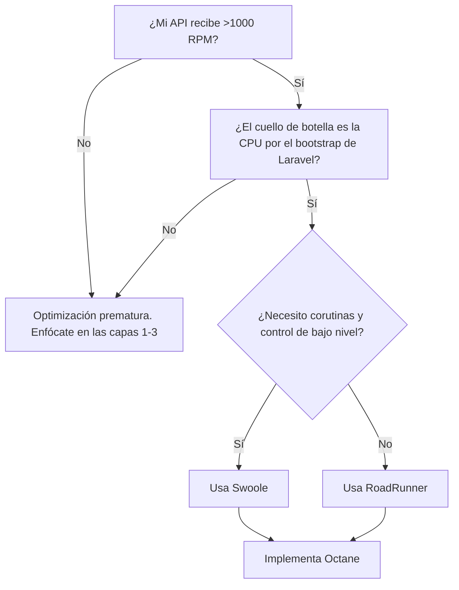

# Artefacto Técnico: Optimización de Framework Laravel API-Only v1.0

**Autor:** Arquitecto de Desempeño Senior
**Dirigido a:** Desarrolladores Senior de PHP/Laravel
**Objetivo:** Servir como guía definitiva para transformar una instalación estándar de Laravel en una plataforma de API minimalista y de alto rendimiento, reduciendo la latencia y la huella de memoria, sin sacrificar el acceso a componentes clave del ecosistema.

---

## Tabla de Contenidos

1.  [Análisis de Carga Base (Benchmark Inicial)](#1-análisis-de-carga-base-benchmark-inicial)
2.  [Estrategia de Optimización por Capas](#2-estrategia-de-optimización-por-capas)
    *   [Capa 1: Configuración de Servicios y Autoloader](#capa-1-configuración-de-servicios-y-autoloader-máximo-impacto)
    *   [Capa 2: Optimizaciones de Arranque en Runtime](#capa-2-optimizaciones-de-arranque-en-runtime)
    *   [Capa 3: Optimizaciones a Nivel de Servidor y PHP](#capa-3-optimizaciones-a-nivel-de-servidor-y-php)
    *   [Capa 4: Optimizaciones de Código y Dependencias](#capa-4-optimizaciones-de-código-y-dependencias)
3.  [Flujo de Trabajo de Optimización (Checklist)](#3-flujo-de-trabajo-de-optimización-step-by-step)
4.  [Validación y Métricas de Éxito](#4-validación-y-métricas-de-éxito)
5.  [Advertencias y Buenas Prácticas](#5-advertencias-y-buenas-prácticas)
6.  [Glosario Técnico](#6-glosario-técnico)

---

## 1. Análisis de Carga Base (Benchmark Inicial)

Antes de cualquier optimización, es imperativo establecer una línea base. Sin métricas iniciales, es imposible cuantificar el impacto de nuestras acciones.

### Métodos de Profiling

1.  **Medición en el Ciclo de Vida:**
    Crea un middleware simple o modifica tu controlador base para registrar métricas clave.

    ```php
    // Ejemplo en un middleware o al final de una acción de controlador
    $executionTime = (microtime(true) - LARAVEL_START) * 1000; // ms
    $memoryPeak = memory_get_peak_usage(true) / 1024 / 1024; // MB

    // Log o retorna estos valores en una cabecera de debug
    // header('X-Debug-Time: ' . $executionTime . 'ms');
    // header('X-Debug-Memory: ' . $memoryPeak . 'MB');
    ```

2.  **Conteo de Clases Cargadas:**
    Un indicador directo de la carga del autoloader.

    ```bash
    # En tu entorno de desarrollo, después de una petición
    echo count(get_declared_classes());

    # En CI/CD, analiza el tamaño del classmap generado
    composer dump-autoload -o --no-dev
    ls -lh vendor/composer/autoload_classmap.php
    ```

### Herramientas Recomendadas

*   **Laravel Telescope:** **Exclusivamente para desarrollo.** Ideal para identificar cuellos de botella como consultas N+1, peticiones lentas y eventos. Su sobrecarga lo hace inviable para producción.
*   **Blackfire.io:** La herramienta profesional para profiling en staging y producción. Proporciona grafos de llamadas detallados, consumo de CPU, I/O y memoria, permitiendo identificar con precisión las funciones y métodos más costosos.

---

## 2. Estrategia de Optimización por Capas

Aplicaremos optimizaciones de forma incremental, midiendo el impacto en cada capa.

### Capa 1: Configuración de Servicios y Autoloader (Máximo Impacto)

Esta capa ofrece el mayor retorno de inversión en rendimiento, ya que reduce drásticamente los objetos y archivos cargados en cada petición.

**Beneficio Esperado:** Reducción de ~20-40% en tiempo de bootstrap y ~15-30% en uso de memoria.

#### 1.1. Poda de Service Providers (`config/app.php`)

Analiza y comenta los proveedores que no son estrictamente necesarios para una API sin estado con autenticación por token.

| Proveedor de Servicio | Acción Recomendada (API-Only) | Impacto | Riesgo |
| :--- | :--- | :--- | :--- |
| `Illuminate\View\ViewServiceProvider` | **Remover siempre** | Muy Alto | Bajo |
| `Illuminate\Cookie\CookieServiceProvider`| **Remover siempre** | Alto | Bajo |
| `Illuminate\Session\SessionServiceProvider`| **Remover (usar tokens)** | Muy Alto | Medio¹ |
| `Illuminate\Translation\TranslationServiceProvider`| Remover si la API es monolingüe | Medio | Bajo |
| `Illuminate\Broadcasting\BroadcastServiceProvider`| Remover si no usas WebSockets | Medio | Bajo |
| `Illuminate\Bus\BusServiceProvider` | **Mantener** (para Jobs/Queues) | Crítico | - |
| `Illuminate\Cache\CacheServiceProvider` | Mantener si usas caché de forma explícita | Crítico | - |
| `Illuminate\Database\DatabaseServiceProvider`| **Mantener** (para Eloquent) | Crítico | - |
| `Illuminate\Routing\RoutingServiceProvider`| **Mantener** | Crítico | - |
| `Illuminate\Auth\AuthServiceProvider` | **Mantener** (para Policies/Gates) | Crítico | - |
| `Illuminate\Auth\Passwords\PasswordResetServiceProvider`| Remover si el reseteo es por API stateless | Medio | Bajo |

¹ *Remover `SessionServiceProvider` deshabilita `Auth::user()` basado en sesión y el helper `auth()`. Asegúrate de que tu sistema (ej. Sanctum) no dependa de la sesión para la autenticación.*

#### 1.2. Optimización Agresiva del Autoloader de Composer

Configura `composer.json` para generar un autoloader altamente optimizado.

```json
{
    "config": {
        "optimize-autoloader": true,
        "classmap-authoritative": true,
        "apcu-autoloader": true
    },
    "scripts": {
        "post-install-cmd": [
            "php artisan clear-compiled",
            "php artisan optimize"
        ],
        "post-update-cmd": [
            "php artisan clear-compiled",
            "php artisan optimize"
        ]
    }
}
```

**Flujo de CI/CD:** El script de despliegue a producción **DEBE** ejecutar:

```bash
# 1. Instala dependencias de producción únicamente
composer install --no-dev --no-interaction

# 2. Genera el autoloader optimizado (classmap)
composer dump-autoload --optimize --classmap-authoritative

# 3. Genera cachés de la aplicación (ver Capa 2)
php artisan config:cache
php artisan route:cache
php artisan view:clear # Aunque no uses vistas, limpia por si acaso
```

### Capa 2: Optimizaciones de Arranque en Runtime

Una vez que el autoloader está optimizado, minimizamos el trabajo que Laravel hace al arrancar.

**Beneficio Esperado:** Reducción adicional de ~15-25% en tiempo de bootstrap.

#### 2.1. Caché de Configuración y Rutas

Estos comandos serializan los archivos de configuración y rutas en un único fichero, evitando que Laravel los parsee en cada petición.

```bash
php artisan config:cache
php artisan route:cache
```

> **ADVERTENCIA CRÍTICA:**
> *   **NUNCA** ejecutes estos comandos en tu entorno de **desarrollo local**. Cualquier cambio que hagas en `.env`, archivos de configuración o rutas no se reflejará.
> *   Estos comandos deben ser parte de tu **script de despliegue automático**. Para invalidar la caché, simplemente vuelve a ejecutarlos.

#### 2.2. Creación de un Kernel de API Personalizado

Por defecto, Laravel carga un conjunto de middlewares globales pensados para aplicaciones web. Crearemos un `Kernel` específico para la API.

1.  **Crea el archivo `app/Http/KernelApi.php`:**

    ```php
    <?php
    namespace App\Http;

    use Illuminate\Foundation\Http\Kernel as HttpKernel;

    class KernelApi extends HttpKernel
    {
        // 1. Elimina todos los middlewares globales innecesarios
        protected $middleware = [
            \Illuminate\Http\Middleware\TrustProxies::class,
            \Fruitcake\Cors\HandleCors::class, // Mantener para CORS
            \Illuminate\Foundation\Http\Middleware\PreventRequestsDuringMaintenance::class,
            \Illuminate\Foundation\Http\Middleware\ValidatePostSize::class,
            \Illuminate\Foundation\Http\Middleware\TrimStrings::class,
            \Illuminate\Foundation\Http\Middleware\ConvertEmptyStringsToNull::class,
        ];

        protected $middlewareGroups = [
            'api' => [
                'throttle:api', // Indispensable
                \Illuminate\Routing\Middleware\SubstituteBindings::class,
                // 'auth:sanctum', // Aplícalo a rutas específicas, no globalmente
            ],
        ];

        // 2. Mapea solo los middlewares que realmente necesitas
        protected $routeMiddleware = [
            'auth' => \App\Http\Middleware\Authenticate::class,
            'auth.basic' => \Illuminate\Auth\Middleware\AuthenticateWithBasicAuth::class,
            'cache.headers' => \Illuminate\Http\Middleware\SetCacheHeaders::class,
            'can' => \Illuminate\Auth\Middleware\Authorize::class,
            'throttle' => \Illuminate\Routing\Middleware\ThrottleRequests::class,
            'verified' => \Illuminate\Auth\Middleware\EnsureEmailIsVerified::class,
            'auth.sanctum' => \Laravel\Sanctum\Http\Middleware\EnsureFrontendRequestsAreStateful::class, // O tu middleware JWT
        ];
    }
    ```

2.  **Modifica `bootstrap/app.php` para usar el nuevo Kernel:**
    Instruye a Laravel para que cargue `KernelApi` en lugar del `Kernel` por defecto para las peticiones de API.

    ```php
    // Al final del archivo bootstrap/app.php

    $app->singleton(
        Illuminate\Contracts\Http\Kernel::class,
        // Decide qué Kernel usar basado en el contexto
        (php_sapi_name() === 'cli' || str_starts_with($_SERVER['REQUEST_URI'] ?? '', '/api'))
            ? App\Http\KernelApi::class
            : App\Http\Kernel::class
    );

    return $app;
    ```

### Capa 3: Optimizaciones a Nivel de Servidor y PHP

Estas optimizaciones operan por encima del framework, reduciendo la sobrecarga de PHP y del servidor web.

**Beneficio Esperado:** Mejora drástica en throughput (solicitudes/segundo) y latencia bajo carga.

#### 3.1. Configuración de `php.ini` y PHP-FPM

*   **OPcache:** Es la optimización más crítica. Asegúrate de que esté habilitado y configurado agresivamente para producción.

    ```ini
    ; php.ini (Producción)
    opcache.enable=1
    opcache.memory_consumption=256      ; 128MB o 256MB es un buen punto de partida
    opcache.interned_strings_buffer=32  ; Aumenta para frameworks grandes
    opcache.max_accelerated_files=20000 ; Ajusta al número de archivos de tu proyecto
    opcache.validate_timestamps=0       ; ¡Máximo rendimiento! Requiere limpiar opcache en cada despliegue.
    opcache.save_comments=1             ; Requerido por algunas librerías
    opcache.enable_file_override=1      ; Requerido
    ```

*   **Realpath Cache:** Reduce las costosas llamadas al sistema de archivos.

    ```ini
    realpath_cache_size=4096K
    realpath_cache_ttl=600
    ```

*   **PHP-FPM Process Manager (`pm`):** Para APIs, `ondemand` o `dynamic` son generalmente mejores que `static`.

    ```ini
    ; www.conf
    pm = dynamic
    pm.max_children = 50 ; (RAM_Total - RAM_Sistema) / RAM_Promedio_Por_Proceso_PHP
    pm.start_servers = 10
    pm.min_spare_servers = 5
    pm.max_spare_servers = 20
    pm.max_requests = 1000 ; Reinicia procesos para prevenir fugas de memoria
    ```

#### 3.2. Implementación de Laravel Octane

Octane mantiene tu aplicación en memoria entre peticiones, eliminando casi por completo el costo de arranque del framework.

**Decisión: ¿Debo usar Octane?**



*   **RoadRunner vs. Swoole:**
    *   **RoadRunner:** Binario autocontenido en Go. Más fácil de instalar y mantener. Ideal para empezar.
    *   **Swoole:** Extensión de PHP en C. Más potente, ofrece corutinas nativas, pero puede ser más complejo de configurar.

*   **Instalación (con RoadRunner):**

    ```bash
    composer require laravel/octane
    php artisan octane:install --server=roadrunner
    ```

*   **Patrones de Código para Octane:**
    *   **Inyección de Dependencias es Obligatoria:** Evita singletons y variables estáticas que contengan estado de la petición.
    *   **Manejo de Conexiones:** Octane gestiona las conexiones a la base de datos. No las cierres manualmente.
    *   **Limpieza de Estado:** Usa el evento `Octane::terminating` para limpiar cualquier estado que se haya acumulado durante una petición.

### Capa 4: Optimizaciones de Código y Dependencias

Optimizaciones a nivel de aplicación para asegurar que solo se carga lo que se usa.

#### 4.1. Auditoría de Dependencias

Limpia tu `composer.json` de paquetes innecesarios.

```bash
# Revisa por qué un paquete está instalado
composer why nunomaduro/collision

# Audita vulnerabilidades conocidas
composer audit
```

#### 4.2. Lazy/Eager Loading forzado

El problema N+1 es un asesino silencioso del rendimiento.

*   **MAL:** Carga relaciones de forma perezosa dentro de un bucle.

    ```php
    // Genera N+1 consultas
    $reservas = Reserva::all();
    foreach ($reservas as $reserva) {
        // Se ejecuta una consulta por cada reserva para obtener el cliente
        echo $reserva->cliente->nombre;
    }
    ```

*   **BIEN:** Carga previa de relaciones (Eager Loading).

    ```php
    // Genera solo 2 consultas
    $reservas = Reserva::with('cliente')->get();
    foreach ($reservas as $reserva) {
        echo $reserva->cliente->nombre;
    }
    ```

#### 4.3. Proveedores de Servicios Diferidos (Deferred Providers)

Si un servicio pesado (ej: un SDK de un tercero como Stripe o AWS) solo se usa en unas pocas rutas, conviértelo en un proveedor diferido.

1.  Crea el `ServiceProvider`: `php artisan make:provider StripeServiceProvider`
2.  Implementa la interfaz `DeferrableProvider` y define el método `provides`.

    ```php
    <?php
    namespace App\Providers;

    use Illuminate\Contracts\Support\DeferrableProvider;
    use Illuminate\Support\ServiceProvider;
    use Stripe\StripeClient;

    class StripeServiceProvider extends ServiceProvider implements DeferrableProvider
    {
        public function register()
        {
            $this->app->singleton(StripeClient::class, function ($app) {
                return new StripeClient(config('services.stripe.secret'));
            });
        }

        // Este método le dice a Laravel qué servicio se está proveyendo.
        public function provides()
        {
            return [StripeClient::class];
        }
    }
    ```

3.  Regístralo en `config/app.php`. Laravel ahora solo cargará este proveedor cuando `StripeClient::class` sea resuelto por el contenedor.

---

## 3. Flujo de Trabajo de Optimización (Step-by-Step)

Usa esta checklist para aplicar y validar las optimizaciones.

1.  [ ] **Benchmark Inicial:**
    *   [ ] Ejecuta pruebas de carga (ej. `ab`, `k6`) contra una ruta simple (GET con DB) y una compleja (POST con validación).
    *   [ ] Registra: TTFB, pico de memoria, solicitudes/segundo.

2.  [ ] **Aplicar Capa 1:**
    *   [ ] Edita `config/app.php` y comenta los `ServiceProviders` innecesarios.
    *   [ ] Actualiza `composer.json` con la configuración de optimización.

3.  [ ] **Aplicar Capa 2:**
    *   [ ] Crea `app/Http/KernelApi.php`.
    *   [ ] Modifica `bootstrap/app.php` para usar el nuevo Kernel.

4.  [ ] **Despliegue y Caché (Simulación de Producción):**
    *   [ ] Ejecuta `composer install --no-dev --optimize-autoloader`.
    *   [ ] Ejecuta `php artisan config:cache` y `php artisan route:cache`.

5.  [ ] **Re-Benchmark y Comparar:**
    *   [ ] Vuelve a ejecutar las mismas pruebas de carga.
    *   [ ] Compara los resultados con la línea base. Deberías ver una mejora significativa.

6.  [ ] **Aplicar Capa 3 (Requiere acceso al servidor):**
    *   [ ] Ajusta la configuración de `opcache` en `php.ini`.
    *   [ ] Ajusta la configuración de `pm` en tu pool de PHP-FPM.
    *   [ ] Reinicia PHP-FPM y vuelve a ejecutar el benchmark.

7.  [ ] **(Opcional) Aplicar Octane para Alta Escala:**
    *   [ ] Instala y configura Octane.
    *   [ ] Ejecuta la aplicación con `php artisan octane:start`.
    *   [ ] Ejecuta el benchmark final.

---

## 4. Validación y Métricas de Éxito

### Métricas Clave

*   **Tiempo hasta el Primer Byte (TTFB):** Mide la latencia del backend, incluyendo el bootstrap.
*   **Pico de Uso de Memoria:** Cuánta RAM consume una petición en su punto máximo.
*   **Throughput (Solicitudes por Segundo):** Cuántas peticiones puede manejar el servidor.

### Endpoint de Reporte de Rendimiento

Crea una ruta protegida para monitorear el rendimiento en tiempo real.

```php
// routes/api.php
Route::get('/health/performance', function () {
    if (!app()->environment('local')) {
        abort(404);
    }
    return response()->json([
        'status' => 'ok',
        'metrics' => [
            'memory_peak_mb' => round(memory_get_peak_usage(true) / 1024 / 1024, 2),
            'execution_time_ms' => round((microtime(true) - LARAVEL_START) * 1000, 2),
        ],
    ]);
});
```

### Valores Objetivo

Para una API REST bien optimizada sobre hardware moderno (sin Octane):

*   **Ruta GET simple (con 1 consulta a DB):**
    *   **TTFB:** < 60ms
    *   **Pico de Memoria:** < 15MB
*   **Ruta POST (con validación y escritura en DB):**
    *   **TTFB:** < 100ms
    *   **Pico de Memoria:** < 20MB

Con **Laravel Octane**, estos valores pueden reducirse en un 50-80% adicional.

---

## 5. Advertencias y Buenas Prácticas

*   **NO a la Optimización Prematura:** La legibilidad y mantenibilidad del código son más importantes que micro-optimizaciones. "La optimización prematura es la raíz de todo mal" - Donald Knuth. La seguridad (ej. hashing de contraseñas) es **innegociable** y siempre tendrá un costo de rendimiento.
*   **Compatibilidad:** Aplicar estas optimizaciones puede romper funcionalidades que dependen de la sesión (ej. `web` middleware group, `Fortify` en modo web). Asegúrate de que tu arquitectura es verdaderamente stateless.
*   **Diferenciación de Entornos:** Es **crítico** mantener configuraciones distintas para desarrollo y producción.

| Parámetro | Desarrollo (local) | Producción (staging/prod) |
| :--- | :--- | :--- |
| `APP_DEBUG` | `true` | `false` |
| `Cache de Config/Rutas` | **No usar** | **Activa (en despliegue)** |
| `OPcache Validation` | `opcache.validate_timestamps=1` | `opcache.validate_timestamps=0` |
| `Dev Dependencies` | Instaladas | No instaladas (`--no-dev`) |
| `Herramientas Debug` | Telescope, Debugbar | Deshabilitadas |

---

## 6. Glosario Técnico

*   **Bootstrap (Arranque):** El proceso inicial que realiza Laravel en cada petición para cargar la configuración, registrar proveedores de servicios y preparar el framework antes de ejecutar tu código.
*   **FPM (FastCGI Process Manager):** Un gestor de procesos para PHP que mantiene "workers" listos para manejar peticiones web, evitando el costo de iniciar un proceso de PHP desde cero cada vez.
*   **OPcache:** Una extensión de PHP que almacena en memoria el código PHP precompilado (bytecode), eliminando la necesidad de compilar los scripts en cada petición.
*   **Stateless (Sin Estado):** Una arquitectura de API donde cada petición del cliente contiene toda la información necesaria para ser procesada, sin depender de sesiones o estado almacenado en el servidor entre peticiones.
*   **TTFB (Time To First Byte):** El tiempo que transcurre desde que un cliente hace una petición hasta que recibe el primer byte de la respuesta. Es una métrica clave para medir la latencia del backend.
*   **Throughput (Rendimiento):** La cantidad de trabajo que un sistema puede realizar en un período de tiempo determinado, comúnmente medido en solicitudes por segundo (RPS).
